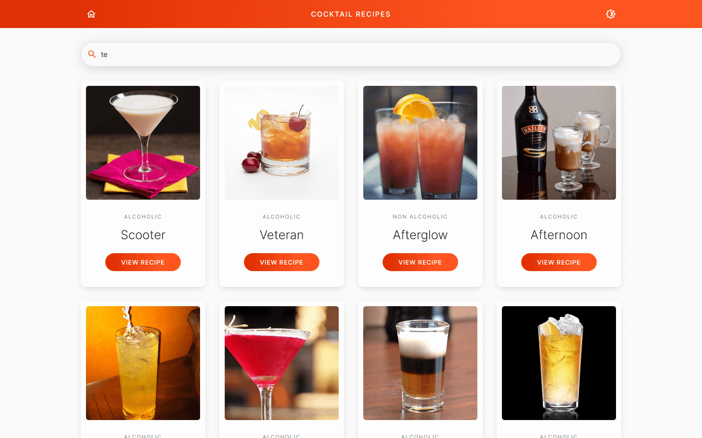
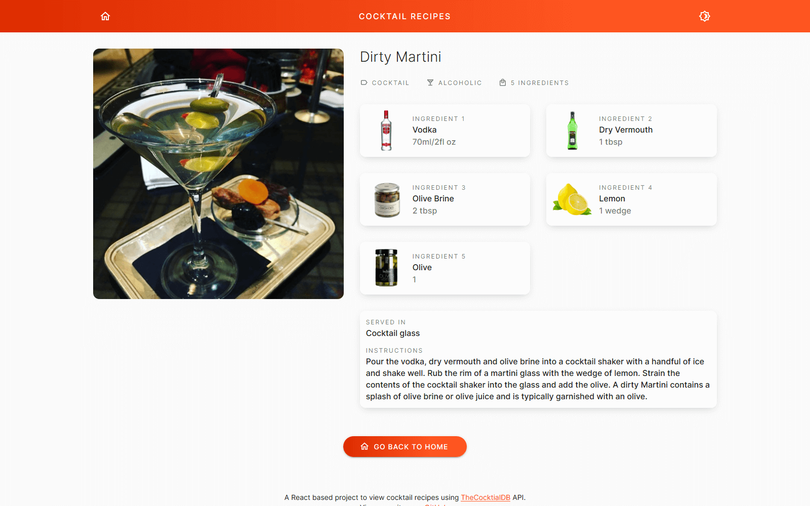

# React Cocktail Database
A React application for viewing recipes of drinks and cocktails from around the world with the help of [TheCocktailDB](https://www.thecocktaildb.com).

See the working example at https://iftee.github.io/react-cocktail-database/

## Features
- Search and view recipes of drinks and cocktails from around the world.
- Peristant regular and dark mode.

## Developer Instruction
For a fresh got clone, to install all node dependencies, use
```shell
npm install
```
To start the development server, use
```shell
npm run start
```
To create a production build, use
```shell
npm run start
```
To deploy at `github-pages` environmet, use
```shell
npm run deploy
```

## Current Limitation
Opening a link in new tab will take the new tab to Home page. This is a GitHub Pages limitation after patching the 404 issue as per the [instrusctions](https://create-react-app.dev/docs/deployment/#notes-on-client-side-routing) from Create React App.

This will not occur when you work on local server or deploy to the root of a custom domain.

## Future Plans
When I have free time:
- [ ] Adding feature to store cocktails in local storage to save API hit.

## Tools Used
- [Create React App](https://create-react-app.dev) to bootstrap the application
- [TheCocktailDB API v1](https://www.thecocktaildb.com/api.php) to fetch data from
- Material Design through [React Bulma Components](https://material-ui.com) to make styled layout
- [React Routers](https://github.com/ReactTraining/react-router) to make the application routes

## Screenshots



